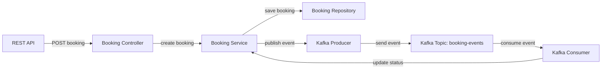

Here is a suggested README.md for the travel-booking-demo application:

# Travel Booking Demo Application

## Overview
The Travel Booking Demo is a Spring Boot application that demonstrates a booking service. It allows creating new bookings via a REST API endpoint. Booking events are published to a Kafka topic and consumed by the application itself to update the booking status asynchronously.

## Flow Description


The flow of the application is as follows:
1. The REST API receives a POST request to create a new booking at the `/api/bookings` endpoint.
2. The `BookingController` handles the request and calls the `BookingService` to create a new booking.
3. The `BookingService` saves the new booking entity using the `BookingRepository`. 
4. The `BookingService` publishes a `BookingEvent` to the `booking-events` Kafka topic using the `BookingEventProducer`.
5. The `BookingEventConsumer` consumes events from the `booking-events` topic.
6. When a `BookingEvent` is consumed, the `BookingService` is called to update the booking status based on the event.

## API Endpoints

### Create Booking
- URL: `/api/bookings`
- Method: `POST`
- Request Body:
  ```json
  {
    "name": "John Doe",
    "destination": "New York"
  }
  ```
- Response Body:
  ```json
  {
    "id": 1,
    "name": "John Doe", 
    "destination": "New York",
    "status": "PENDING"
  }
  ```

## Kafka Topics

### Produced Topics
- `booking-events`: The application produces `BookingEvent` objects to this topic when a new booking is created.

### Consumed Topics
- `booking-events`: The application consumes `BookingEvent` objects from this topic to update booking statuses asynchronously.

## Configuration
The application configuration is defined in the `application.yml` file:
- `spring.kafka.bootstrap-servers`: The Kafka bootstrap servers to connect to.
- `spring.kafka.consumer.group-id`: The consumer group ID for the Kafka consumer.
- `booking.topic.name`: The name of the Kafka topic for booking events.

The Kafka producer and consumer configuration is defined in the `BookingKafkaConfig` class.

## Dependencies
The main dependencies used in this application are:
- `spring-boot-starter-web`: Starter for building web applications using Spring MVC.
- `spring-kafka`: Spring Kafka support for producing and consuming events.
- `spring-boot-starter-data-jpa`: Starter for using Spring Data JPA with Hibernate.
- `h2`: H2 in-memory database for development and testing.